<p align="center">
   who is esmail? — AI Research Engineer: LLMs, distributed training, MoE · 7 arXiv publications · PyTorch & CUDA">
</p>

### `> whoami`

<samp>⏺ <b>Read</b>(about.md)</samp><br>
<samp>&nbsp;&nbsp;⎿&nbsp;&nbsp;Read 3 lines</samp>

**AI Research Engineer** with a deep passion for neural networks, large language models, and scalable ML systems. Strong foundation in **PyTorch** and **CUDA**; committed to open-source development and to bridging the gap between research and real-world applications by translating papers into practical implementations.

<sub>see also: [portfolio ↗](https://esmail-ibraheem.github.io/portfolio/)</sub>

---

### `> /publications`

<samp>⏺ <b>Read</b>(publications/)</samp><br>
<samp>&nbsp;&nbsp;⎿&nbsp;&nbsp;7 papers · ordered by most proud of</samp>

1. [ExpertRAG: Efficient RAG with Mixture of Experts — Optimizing Context Retrieval for Adaptive LLM Responses](https://arxiv.org/abs/2504.08744)
2. [Galvatron: Automatic Distributed Training for Large Transformer Models](https://arxiv.org/abs/2504.03662)
3. [Theoretical Foundations and Mitigation of Hallucination in Large Language Models](https://arxiv.org/abs/2507.22915)
4. [Mixture of Transformers: Macro-Level Gating for Sparse Activation in Large Language Model Ensembles](http://dx.doi.org/10.13140/RG.2.2.25049.02400)
5. [Bachelor Thesis: AI Engine: Deep Learning and Neural Network Engine](http://dx.doi.org/10.13140/RG.2.2.22814.24643)
6. [Universal Approximation Theorem for a Single-Layer Transformer](https://arxiv.org/abs/2507.10581)
7. [Mixture of Attention Schemes (MoAS): Learning to Route Between MHA, GQA, and MQA](https://arxiv.org/abs/2512.20650)

---

### `> /projects`

<samp>⏺ <b>Bash</b>(ls ~/projects)</samp><br>
<samp>&nbsp;&nbsp;⎿&nbsp;&nbsp;6 directories</samp>

- [**nanograd**](https://github.com/Esmail-ibraheem/nanograd) — ML/DL ecosystem engine: GPT, Llama, Stable Diffusion, ViT · `Python`
- [**Axon**](https://github.com/Esmail-ibraheem/Axon) — paper implementations: InstructGPT, Llama, transformers, diffusion · `Python`
- [**Nexus**](https://github.com/Esmail-ibraheem/Nexus) — dynamic GPU allocation for Mixture-of-Experts · `Python`
- [**NeuroFlow**](https://github.com/Esmail-ibraheem/NeuroFlow) — node-based AI training pipelines · `Python`
- [**Galvatron**](https://github.com/Esmail-ibraheem/Galvatron) — large-scale distributed transformer training · `Python`
- [**ExpertRAG**](https://github.com/Esmail-ibraheem/ExpertRAG) — MoE-routed retrieval-augmented generation · `Python`

---

### `> /skills`

<samp>⏺ <b>Bash</b>(esmail --status)</samp>

```text
Core       Python · PyTorch · CUDA
Research   LLMs · Mixture-of-Experts · RAG · diffusion models
Systems    distributed training · GPU scheduling · inference optimization
Tools      Hugging Face · Git · Linux
```

---

### `> /stats`

<samp>⏺ <b>Bash</b>(gh stats --user Esmail-ibraheem)</samp><br>
<samp>&nbsp;&nbsp;⎿&nbsp;&nbsp;stats: snapshot Jul 2026 · streak: refreshed daily</samp>





---

### `> /contact`

<samp>⏺ <b>Read</b>(contact.md)</samp>

[Portfolio](https://esmail-ibraheem.github.io/portfolio/) · [LinkedIn](https://www.linkedin.com/in/esmail-a-gumaan) · [Google Scholar](https://scholar.google.com/citations?user=FbQKSXkAAAAJ) · [Hugging Face](https://huggingface.co/Esmail-AGumaan) · [ORCID](https://orcid.org/0009-0003-1270-5905) · [ResearchGate](https://www.researchgate.net/profile/Esmail-Gumaan) · [Semantic Scholar](https://www.semanticscholar.org/author/2354181125)

---

<sub><samp>~/esmail-ibraheem · esmail-v25 · ✻ 128k context · ? for shortcuts</samp></sub>
